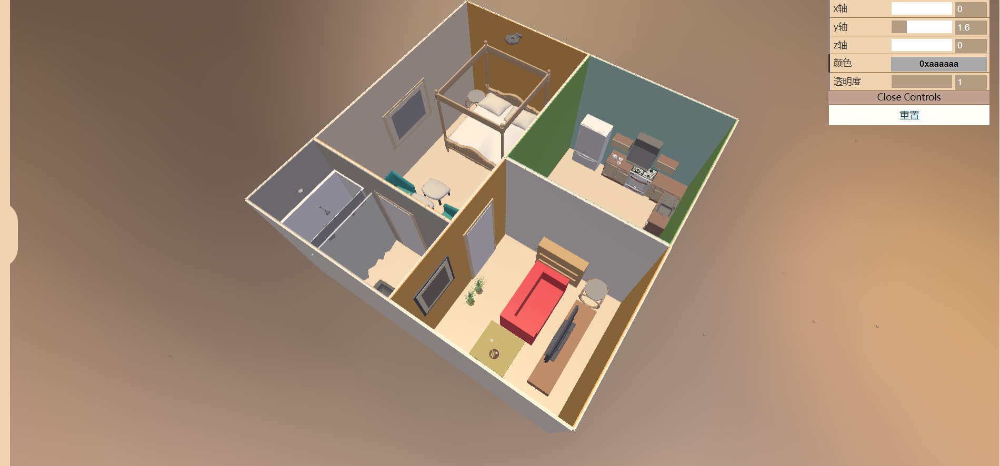
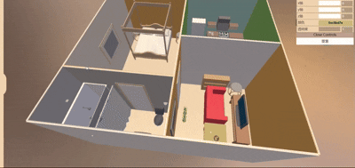
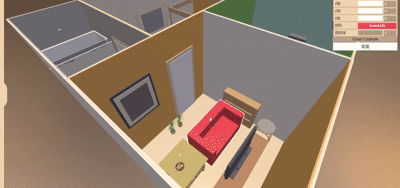
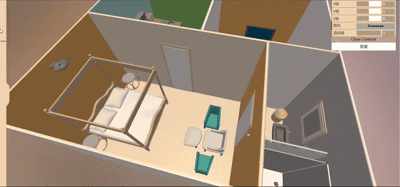

# 简易版3d家装设计（vue3 + three.js + typescript）   
# A simple 3d room design project based on vue3 + three.js + typescript   
    

## Feature
**预览**    
**preview**     
    
    
      
         

**家具拖动、旋转、改变颜色等操作**   
**dragable, rotable, changable to it's color, opacity furnitures**     
    
  
    
      

**支持添加新家具和重置功能**   
**with adding new furniture and reset functionality**    

